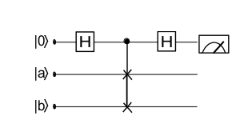
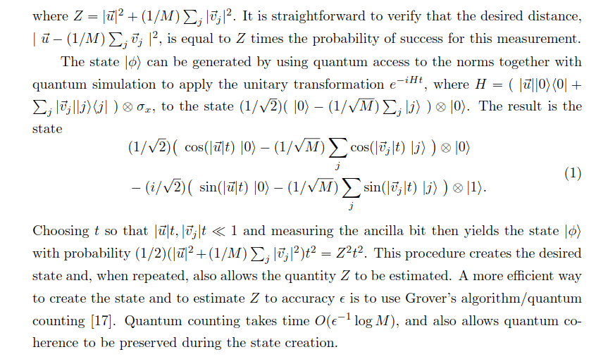

###  This learning is based on 2 papers - https://arxiv.org/pdf/1409.3097 and https://arxiv.org/pdf/1307.0411

So now I will start with some important points.

- The
most common approach in quantum computing is
to represent classical information as binary strings
(x1, ...xn) with xi ∈ {0, 1} for i = 1, ..., n, that
are directly translated into n-qubit quantum states
|x1...xn〉 from a 2n-dimensional Hilbert space with
basis {|0....00〉 , |0....01〉 , ..., |1....11〉}, and to read in-
formation out through measurements. However, existing machine learning algorithms are often based
on an internal structure of this data, for example the
Euclidean distance as a similarity measure between
two examples of features. Alternative data represen-
tations have been proposed by Seth Lloyd and his
co-workers, who encode classical information into the
norm of a quantum state, leading
to the definition [11, 12]
$$
|x〉 = {{1}/{|\vec{x}|}}* (\vec{x})^{1/2}
$$. 

## Quantum Version of K nearest Neighbours

- Given a training set T of
feature vectors with their respective classification
as well as an unclassified input vector ~x, the idea
is to choose the class cx for the new input that
appears most often amongst its k nearest neighbours. A variation of the
algorithm suggests not to run it on the training set,
but to calculate the means or centroid $$ 1/Nc∑p \vec{~vp} $$ 
of all Nc vectors belonging to one class c beforehand,
and to select the class of the nearest centroid (we call
this here the nearest-centroid algorithm). Another
variation weights the influence of the neighbours by
distance.

- A¨ımeur, Brassard and Gambs introduce the
idea of using the overlap or fidelity |〈a| b〉| of two
quantum states |a〉 and |b〉 as a ‘similarity mea-
sure’.

  

$$ P(|0anc〉) = 1/2 + 1/2 |〈a| b〉|^2 . (or of ground state) $$

- Based on the swap test, Lloyd, Mohseni and
Rebentrost recently proposed a way to retrieve
the distance between two real-valued n-dimensional
vectors ~a and ~b through a quantum measurement.

So now continuing with the lloyd's paper

- First, classical data expressed in the form of N -dimensional complex
vectors can be mapped onto a quantum states over log2 N qubits: when the data is stored in a quantum random access memory (qRAM), this mapping takes O(log2 N) steps.
Once it is in quantum form, the data can be post-processed by various quantum
algorithms (quantum Fourier transforms, matrix inversion, etc.), which take time O(poly(log N)). stimating distances and inner products between post-processed vectors in N -dimensional vector spaces then takes time O(log N) on a quantum computer. 

- By contrast, as noted by Aaronson, sampling and estimating distances and inner products between post-processed vectors on a classical computer is apparently exponentially hard.

- Problem of assigning N -dimensional vectors to one of
several clusters of M states takes time O(log(M N )) on a quantum computer, compared with time O(poly(M*N)) for the best known classical algorithm. Performing k-means clustering: using a novel version of the quantum adiabatic algorithm one can classify M vectors into k clusters in time O(k log (k*M*N) ).

- Consider the
vector N = 2n dimensional complex vector ~v with components {vi = |vi|eiφi }. Assume
that {|vi|, φi} are stored as floating point numbers in quantum random access memory.
Constructing the log2 N qubit quantum state 
$$
|x〉 = {{1}/{|\vec{x}|}}* (\vec{x})^{1/2}
$$ 
then takes O(log2 N ) steps as
long as the sub-norms nℓ = ∑
i=1 to l |vi|^2 can be estimated efficiently

- Consider the task of assigning a post-processed vector ~u ∈ RN to one of two sets V, W ,
given M representative samples $$\vec{vj}$$ ∈ V and M samples $$\vec{wk}$$ ∈ W . A common method for
such an assignment is to evaluate the distance $$|\vec{u}−(1/M ) ∑
|j>|\vec{vj}> | $$ between vec{u} and the mean of
the vectors in V , and to assign vec{u} to V if this distance is smaller than the distance between
vec{u} and the mean of W .

- to evaluate the distance from \vec{u} to the mean of V , adjoin an ancilla variable with
M + 1 states. First, construct the state $$|ψ〉 = (1/√2)(|0〉|u〉 + (1/√M ) ∑j=1toM |j〉|vj〉) $$ for
system and ancilla by querying the quantum RAM or by the subroutine described above.
Second, use a swap test to perform a projective measurement on the ancilla alone to
see if it is in the state 
$$|φ〉 = (1/√Z)(|u||0〉 − (1/√M) ∑j=1 to M |vj||j〉$$
for the ancilla alone, where Z = |~u|2 + (1/M ) ∑j |~vj |2.

- To create |0>|u> + |1>|v>, we define unitaries U and V to get to |u> and |v>. Therefore we can see that this is a unitary gate $$ <0||0> * U + <1||1>*V $$ and when we take , IN similar way we can create state Si.

  

- A similar speed-up extends to unsupervised learning. Consider the k-means problem of assigning M
vectors to k clusters in a way that minimizes the average distance to the centroid of the
cluster. The standard method for solving k-means is Lloyd’s algorithm (no relation
to the co-author of this paper): (0) choose the initial centroid randomly or by a method
such as k-means++; (1) assign each vector to the cluster with the closest mean; (2) re-
calculate the centroids of the clusters; repeat steps (1-2) until a stationary assignment is
attained. When classical estimation of the distance to the centroids in the N -dimensional
space takes time O(N ), each step of the classical algorithm takes time O(M 2N ), while
the quantum Lloyd’s algorithm takes time O(M log(M N )). 

Will be continued...